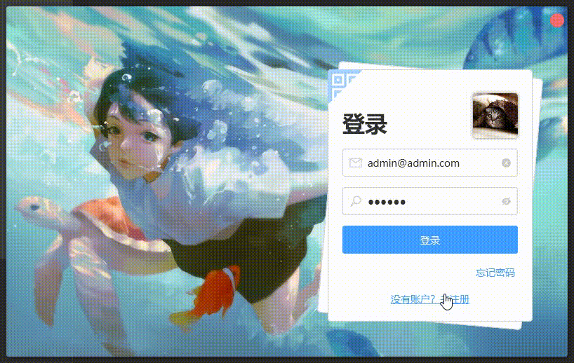
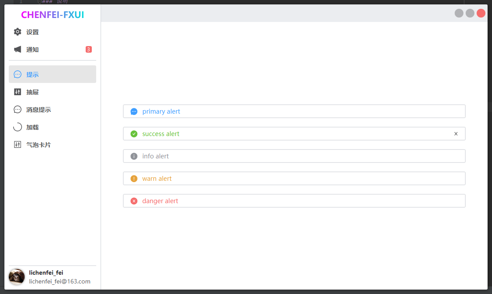
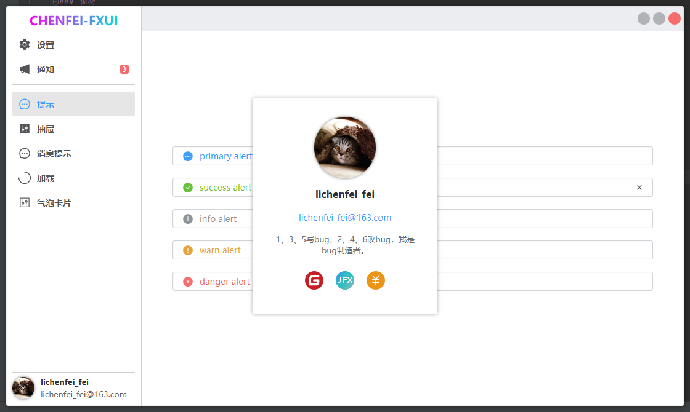
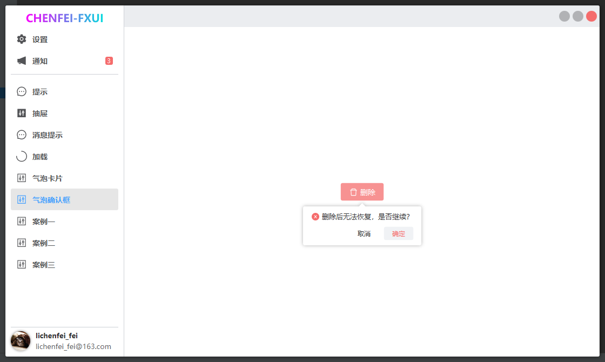
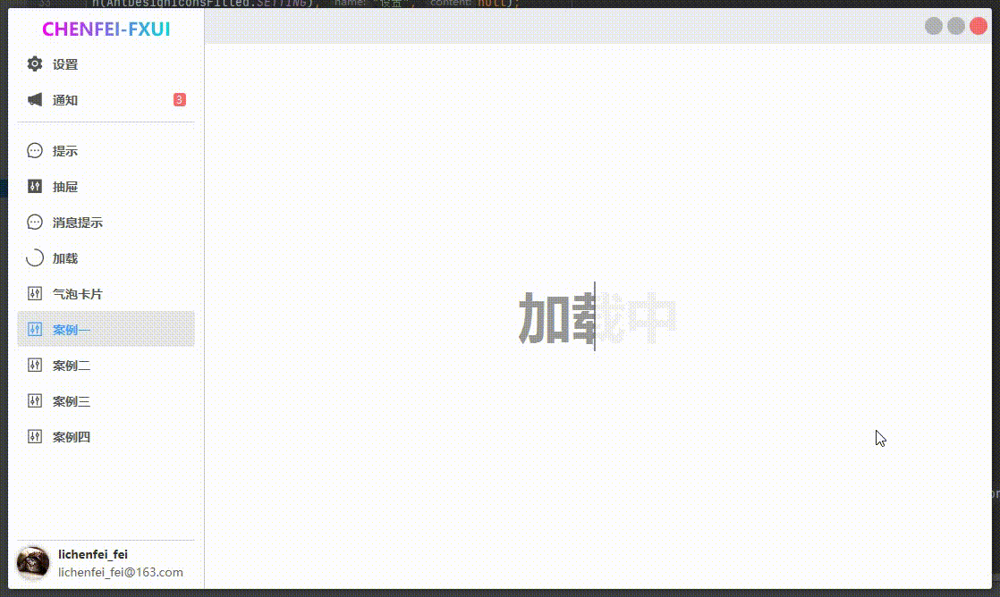
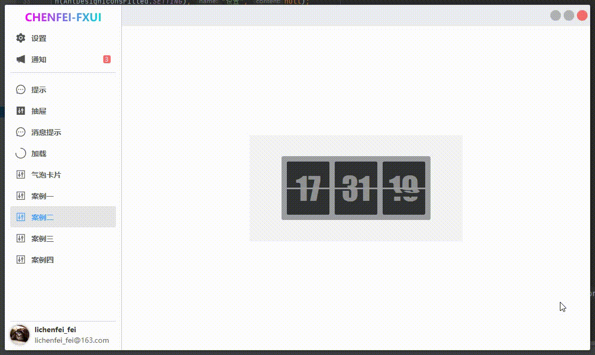
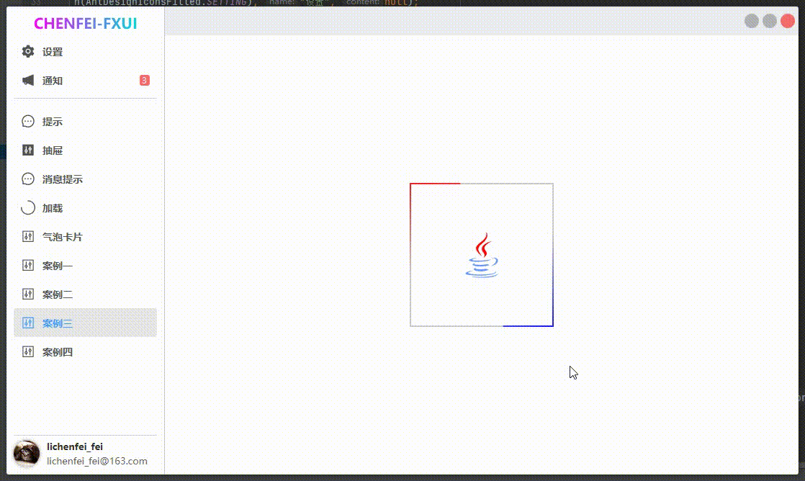

### 说明

- 该项目处于开发阶段，功能并不完善。若要使用，请慎重选择。
- 作者还有好多想法没有在这个项目中实现，后期会不断更新该项目。
- 目的：写一个JavaFx项目，封装一些常用组件，写一些自己感兴趣的东西（Java Gui 也可以写出漂亮的界面）。
- 希望：因为该项目处于开发期，如果你有更好的想法，请在下方留言。

### 项目截图

- 登录注册
  
- 首页
  
- 用户详情页
  
- 气泡确认框
  

- 案例一
  
- 案例二
  
- 案例三
  

### 备注

- 有好些功能没有提供截图，可以clone下来看。